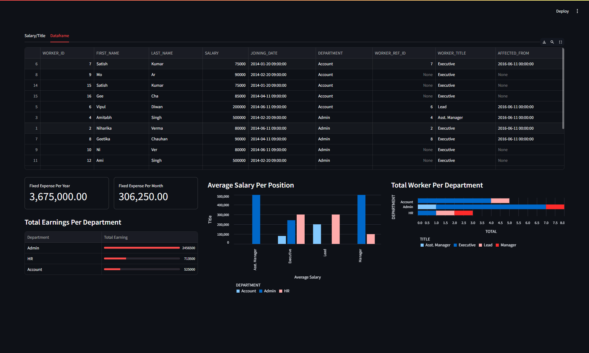

## Dashboard View


## Run
To run this dashboard you need to have Python and the following dependencies installed
- pandas>=2.2.3
- plotly>=6.0.0
- streamlit>=1.43.0

To run the dashboard locally use this command in the  terminal
```
streamlit run .\dashboard.py
```
The Jupyter Notebook contains most of the codes used to get data from CSV files turned into tables for the dashboard
